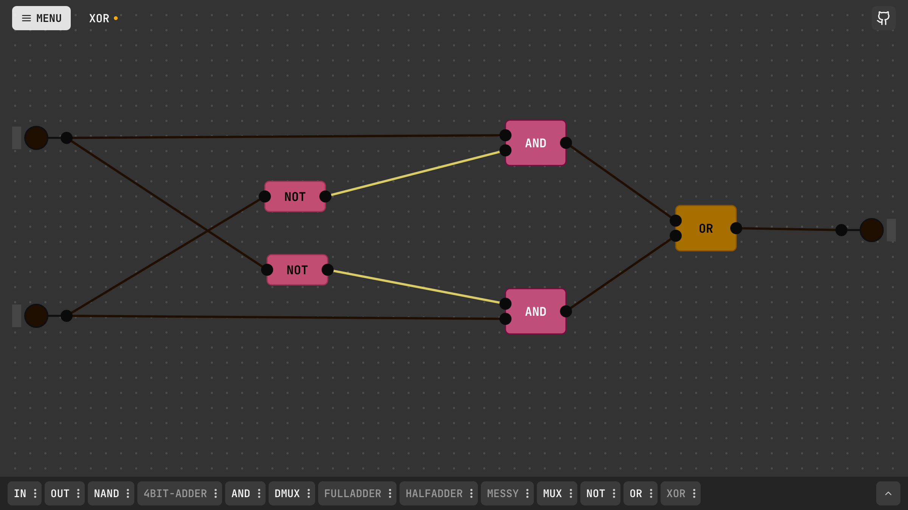

# LogicSim

LogicSim is an interactive, web-based digital circuit simulator. It provides a drag-and-drop canvas interface to build, simulate, and explore complex logic gates and digital circuits directly in the browser.

Demo: [https://logicsim.rijalghodi.xyz](https://logicsim.rijalghodi.xyz/)



## Requirement to Install

This project uses [Bun](https://bun.sh/) as its fast package manager and runtime for development.

1. Install Bun (if you haven't already):
   ```bash
   curl -fsSL https://bun.sh/install | bash
   ```
2. Clone the repository and install dependencies:
   ```bash
   bun install
   ```
3. Start the development server:
   ```bash
   bun run dev
   ```
4. Build for production:
   ```bash
   bun run build
   ```

## Architecture

### Core vs UI Separation

One of the foundational engineering decisions in LogicSim is the strict boundary between the **Simulation Core** (`src/core/`) and the **User Interface** (`src/components/`).

- **Pure TypeScript Core:** The simulation engine is written in pure TypeScript. It has zero knowledge of React, the DOM, or the Canvas. It independently handles logic gate evaluation, state propagation, and wire connections. This makes the core logic highly testable, predictable, and portable (e.g., it could easily run in a Node.js backend or a Web Worker).
- **Reactive UI:** The UI layer strictly consumes the core's state and translates it into visual elements. By keeping the domain logic fully decoupled from the view layer, the visual representation always remains perfectly synced with the underlying mathematical state of the circuit.

### React Konva for High-Performance Rendering

To handle the complexity of rendering interactive circuits with multiple chips, ports, and connecting wires, LogicSim uses **React Konva** (an HTML5 Canvas library).

- **Performance:** Unlike rendering hundreds of DOM nodes (SVG or HTML divs), which can severely degrade performance during panning, zooming, or dragging, Canvas provides a high-performance 2D rendering context suitable for complex visual applications.
- **Interactivity:** React Konva bridges the gap between imperative canvas operations and React's declarative state model. This enables complex interactions like seamless drag-and-drop, infinite canvas panning, and dynamic wire routing to be implemented cleanly and efficiently.

### Pure CSS and React

Instead of relying on heavy CSS utility frameworks (like Tailwind) or bloated component libraries (like MUI or Bootstrap), LogicSim features a custom-built design system using **Pure CSS** and modular React components.

## Features

### Core

- [x] Circuit registry
- [x] Simulation logic

### UI

- [x] Render Chip
- [x] Render Boundary Port
- [x] Render Wire
- [x] Simulate Circuit
- [x] Save, Edit, and Create New Circuit
- [x] Delete Chip
- [x] Chip Context Menu
- [x] Breadcrumb and Detail Chip
- [x] Delete Boundary Port
- [x] Rename Boundary Port
- [x] Color Boundary Port and wire connected
- [x] Clean App.tsx, use hooks.
- [x] Cornered Wire
- [x] slider as color input
- [x] User Preference: show port label, show grid
- [x] Fix sort ports in chip by y-position
- [x] Fix: place chips and port in non-occupied space
- [x] add slider in dock
- [x] Clean CircuitCanvas.tsx
- [ ] Quick Customize Chip
- [ ] Wire coloring
- [ ] Extend wire
- [ ] Undo - Redo (History)
- [ ] Fit position in every screen

---

_Built by [Rijal Ghodi](https://rijalghodi.xyz) - [View on GitHub](https://github.com/rijalghodi/logicsim)_
